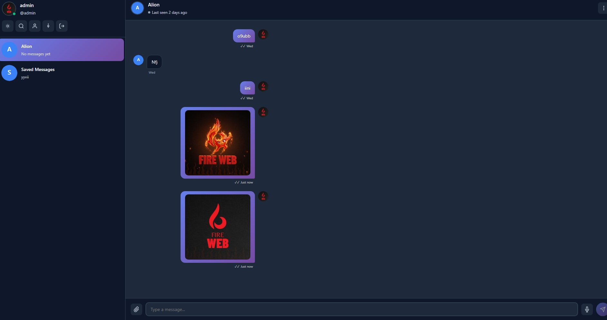

# 🔥 **FireWeb Messenger**

**Keep chatting when the internet goes dark.**

<a href="README_FA.md">🇮🇷 فارسی</a>

## 💡 Why FireWeb?

🚫 Internet censorship? **We don't care.**  
🌐 Network outage? **Keep chatting on local intranet.**  
🔒 Privacy matters? **Your server, your data.**  
⚡ 3-minute setup? **Yes. Really.**

## ⚡ Features

| 🔐 **E2E Encryption** | ⚡ **Lightning Fast** | 📱 **PWA Install** | 🌐 **Offline Ready** |
|:---:|:---:|:---:|:---:|
| Sodium crypto | SQLite engine | Like native app | Service Worker |

## 🚀 Quick Start

1. Clone
git clone https://github.com/PRGPU/FireWebCHAT.git

2. Upload the project files to your server.
3. Open the setup helper at: https://firewebchat.vercel.app
4. Or watch this video tutorial: https://youtu.be/Z_BUtrt-Trc
5. Finally, open your FireWebChat URL in the browser and complete the setup.

https://yourdomain.com/

text

**Setup wizard auto-starts. Done in 3 minutes! 🎉**

## 🛠️ Tech Stack

    

**PHP 8.0+ • SQLite • Sodium • PWA • Service Worker**

## 📸 Screenshots

 

## 🤝 Contribute

Star ⭐ • Fork 🔱 • Pull Request 🚀 • Report Issues 🐛

## 📄 License

**MIT License** - Copyright (c) 2025 ALION ([@PRGPU](https://github.com/PRGPU) / [@Learn_Launch](https://github.com/Learn_Launch))

---

**Built with ❤️ for freedom of communication**

**FIREWEBCHAT**

🔥 *Keep the flame burning* 🔥

<a href="https://github.com/PRGPU/FireWebCHAT/issues">🐛 Report Bug</a> • <a href="https://t.me/prgpu">💬 Telegram</a>

