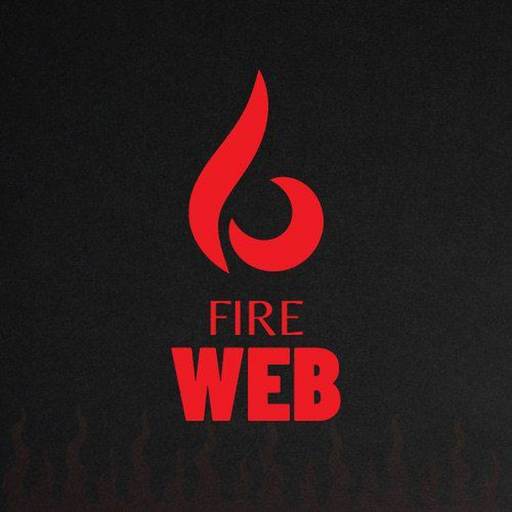
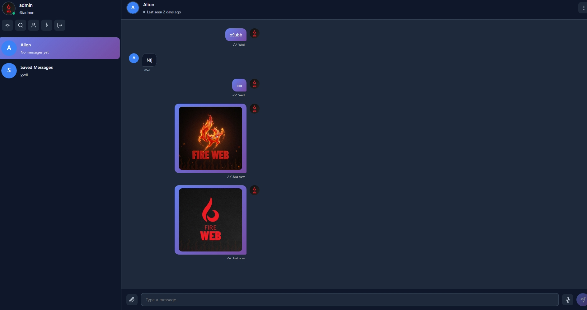
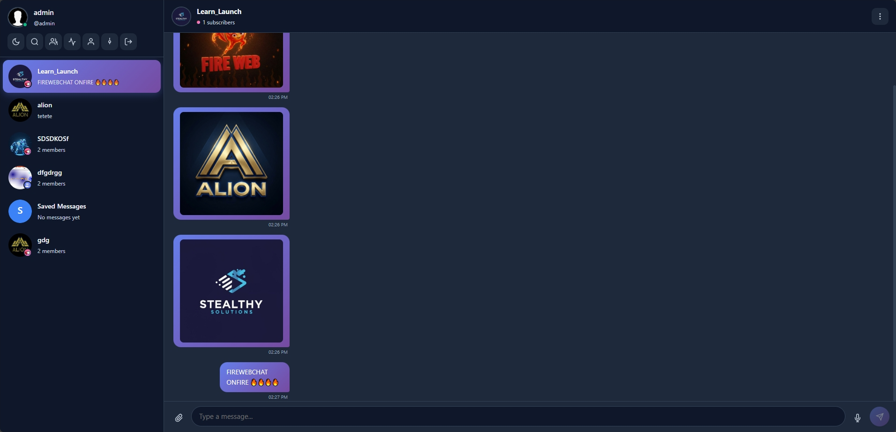

<div align="center">



<br/>


<br/><br/>

[](https://php.net)
[](https://sqlite.org)
[](#)
[](#)
[](https://github.com/PRGPU/FireWebCHAT/releases)

<br/>

[](https://github.com/PRGPU/FireWebCHAT/stargazers)
[](https://github.com/PRGPU/FireWebCHAT/network)
[](https://github.com/PRGPU/FireWebCHAT/issues)

<br/>

<a href="README.md">🇬🇧 English</a> &nbsp;|&nbsp;
<a href="https://youtu.be/Z_BUtrt-Trc">🎬 آموزش ویدیویی</a> &nbsp;|&nbsp;
<a href="https://t.me/prgpu">💬 تلگرام</a> &nbsp;|&nbsp;
<a href="https://github.com/PRGPU/FireWebCHAT/releases">📦 دانلود</a>


</div>

<br/>

## 🔥 فایروب چیست؟

> **پیام‌رسانی که نمی‌شه متوقفش کرد. خودمیزبان، رمزنگاری‌شده، آزاد.**  
> وقتی اینترنت قطع میشه — فایروب از طریق شبکه محلی تو رو آنلاین نگه می‌داره.  
> بدون ابر. بدون ردیابی. بدون توافق.

<br/>

## ⚡ چرا فایروب؟

<div align="center">

|  | سناریو | پاسخ فایروب |
|:---:|:---|:---|
| 🚫 | اینترنت سانسور شده | متصل بمون، اهمیتی نداره |
| 🌐 | قطعی شبکه | روی اینترانت محلی کار می‌کنه، اینترنت لازم نیست |
| 🔒 | حریم خصوصی مهمه | سرور خودت، داده‌های خودت، هیچ واسطه‌ای نیست |
| ⚡ | نصب سخته؟ | **۳ دقیقه. جدی میگم.** |
| 🆓 | هزینه بالا؟ | **کاملاً رایگان و متن‌باز** |

</div>

<br/>

## 🛠️ قابلیت‌ها

<div align="center">

| 🔐 رمزنگاری E2E | 📱 نصب PWA | 🌐 حالت آفلاین | ⚡ فوق‌العاده سریع |
|:---:|:---:|:---:|:---:|
| رمزنگاری Sodium | مثل اپ واقعی نصب میشه | Service Worker | PHP خالص + SQLite |

| 👥 گروه و کانال | 🛡️ پنل مدیریت | 🌙 حالت تاریک | 🧩 بدون وابستگی |
|:---:|:---:|:---:|:---:|
| مدیریت کامل | داشبورد داخلی | طراحی راحت برای چشم | بدون composer، بدون npm |

</div>

<br/>

## 🚀 نصب سریع

```bash
git clone https://github.com/PRGPU/FireWebCHAT.git
```

**مراحل:**

1. 📁 فایل‌ها رو روی سرور آپلود کن (هر هاست اشتراکی کار می‌کنه)
2. 🌐 آدرس دامنه‌ات رو باز کن — ویزارد نصب خودکار شروع میشه
3. ✅ در **۳ دقیقه** آماده‌ای

> 🔧 کمک نیاز داری؟ ابزار راه‌اندازی → [firewebchat.vercel.app](https://firewebchat.vercel.app)  
> 🎬 آموزش ویدیویی → [youtu.be/Z_BUtrt-Trc](https://youtu.be/Z_BUtrt-Trc)

<br/>

## 🧰 تکنولوژی‌ها

<div align="center">


&nbsp;&nbsp;

&nbsp;&nbsp;

&nbsp;&nbsp;

&nbsp;&nbsp;


`PHP 8.0+` &nbsp;•&nbsp; `SQLite` &nbsp;•&nbsp; `Sodium` &nbsp;•&nbsp; `PWA` &nbsp;•&nbsp; `Service Worker`

</div>

<br/>

## 📸 تصاویر

<div align="center">

&nbsp;&nbsp;

</div>

<br/>

## 💛 حمایت

اگه فایروب کمکت کرده آزاد بمونی — از پروژه حمایت کن:

<div align="center">

<a href="https://nowpayments.io/donation/Learn_Launch" target="_blank" rel="noreferrer noopener">
  
</a>

<br/><br/>

**⭐ ستاره دادن به ریپو رایگانه و خیلی مهمه — همین الان بزن!**

</div>

<br/>

## 🤝 مشارکت

همه نوع همکاری خوشامده:

- ⭐ **ستاره** — حمایتت رو نشون بده
- 🐛 **[گزارش باگ](https://github.com/PRGPU/FireWebCHAT/issues)**
- 💡 **[درخواست قابلیت](https://github.com/PRGPU/FireWebCHAT/issues)**
- 🔱 **فورک و Pull Request**

<br/>

## 📄 مجوز

**مجوز MIT** — © ۱۴۰۳ آلیون ([@PRGPU](https://github.com/PRGPU) / [@Learn_Launch](https://github.com/Learn_Launch))

---

<div align="center">


<h3>با ❤️ برای آزادی ارتباطات ساخته شده</h3>

<sub>🔥 <strong>FIREWEBCHAT</strong> — شعله آزادی رو روشن نگه دار 🔥</sub>

<br/><br/>

<a href="https://github.com/PRGPU/FireWebCHAT/issues">🐛 باگ</a> &nbsp;•&nbsp;
<a href="https://github.com/PRGPU/FireWebCHAT/discussions">💡 بحث</a> &nbsp;•&nbsp;
<a href="https://t.me/prgpu">💬 تلگرام</a> &nbsp;•&nbsp;
<a href="https://nowpayments.io/donation/Learn_Launch">💛 دونیت</a>

</div>
